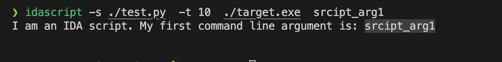
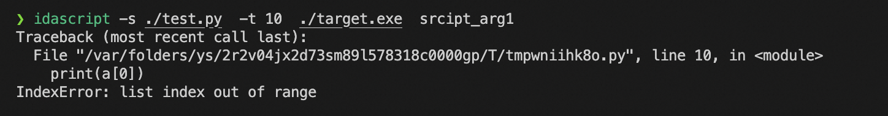
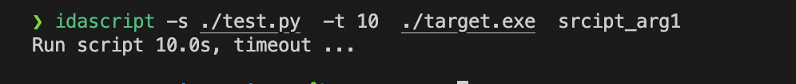

## 介绍
IDA 可以使用 `batch` 模式来运行脚本，例如 `idat64.exe -B -S"test.py" target.exe`。但是运行脚本的时候存在两个问题：
	
	1. IDAPython 的输出放在 IDA 的窗口中，无法直接获取并打印到终端 ；
	2. 错误的脚本可能会导致 IDA 进程无法按照预期关闭，并且不能获取到脚本的错误信息 ;
	3. 没有超时机制，如果 IDApython 脚本陷入死循环，也会导致IDA卡死 。

为了解决上述问题，此项目诞生了。IDAScript包装了IDA的命令行，目的为了更加方便的从命令行批量的执行IDApython脚本。此版本是基于原版的 idascript 改写的，为了跨平台考虑所以使
用 python 进行了重写，目前仅支持 IDApython 脚本的，相关的原理请参考如下项目 `http://www.hexblog.com/?p=128`,`https://github.com/quarkslab/idascript`,`https://github.com/devttys0/idascript`。

## 安装

安装此件本，只需要运行 `python install.py IDA_INSTALLED_PATH`，或者直接运行 `python installl.py`，在提示中输入IDA的安装路径。

例如在 OSX 上：

```bash
python install.py '/Applications/IDA Pro 7.7/ida.app/Contents/MacOS/'
```

在 Linux/OSX 平台上，idascript 将会安装到$PATH 环境变量的第一个路径中，或者被安装到 /usr/local/bin 内，在 windows 平台上，会被安装到 IDA 的安装路径中。
`idascript.py` 会被安装到  `IDA_INSTALLED_PATH/python/` 目录中。

## 使用说明


```bash
❯ idascript --help
usage: idascript [-h] [-s <ida script>] [-t TIMEOUT] [--enable-32bit] <file|path> ...

A script for processing with IDA Pro

positional arguments:
  <file|path>           File or path to process
  params                Additional parameters

options:
  -h, --help            show this help message and exit
  -s <ida script>, --script <ida script>
                        IDAPython script
  -t TIMEOUT, --timeout TIMEOUT
                        Timeout (-1 means no timeout)
  --enable-32bit        Enable 32-bit mode
```

默认是使用 `idat64` 64位去分析二进制程序，如果需要使用32位，请使用参数 `--enable-32bit`，使用示例如下：

```bash
$ idascript --enable-32bit -s test.py -t 10 target.exe 
```

### 例子

此时就可以直接给`test.py`传入参数，并且可以获取到输出，例如:

```python
#test.py 

import idc
print("I am an IDA script. My first command line argument is:", idc.ARGV[1])
```

使用如下方法调用:

```bash
$ idascript -s ./test.py  -t 10  target.exe  srcipt_arg1
```



### 异常处理

写代码谁都会有错误，idascript可以帮你捕捉到错误:

例如如下会报错的代码：

```python
#test.py 
a = []
print(a[0])
```



### 超时处理


```python
#test.py

import time
time.sleep(60)
```



